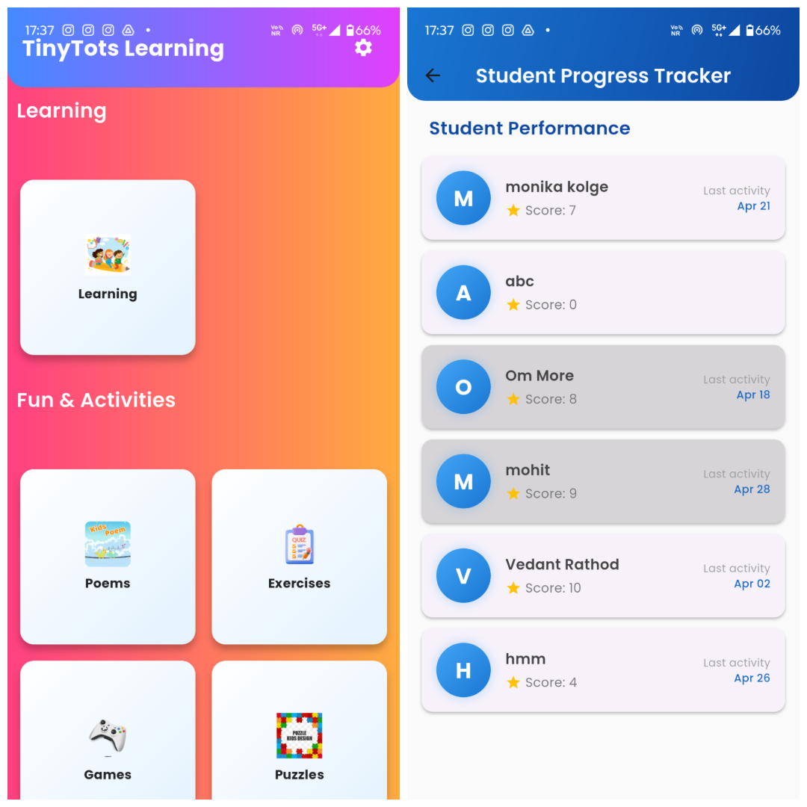

# Tiny Tots - Kids Learning App
**Tiny Tots** is an educational mobile app designed for nursery kids to learn alphabets, numbers, shapes, colors, animals, and more in an interactive and fun way. The app features audio and video learning content, poems, exercises, and games to help little learners engage and grow.

## 🎯 Features
- 📚 4x4 Category grid for learning topics: Alphabets, Numbers, Shapes, Colors, Animals, Birds, Fruits, Food, Vehicles, Toys, Emotions & more
- 🎵 Audio playback for nursery rhymes and poems  
- 📺 Embedded YouTube videos for engaging learning content  
- ✏️ Exercises and games to reinforce learning  
- 👩‍🏫 Separate login/signup for teachers and parents with Firebase Authentication  
- 🧩 Puzzles and fun interactive activities  

## 📸 Screenshots

 

## 🎬 App Working Video
[Click Here](https://drive.google.com/file/d/1M5BcQ-FlZqv7Oq1xocX1_MMYtnaXtRI3/view?usp=drive_link) to watch the demo of the App!!!

## 🛠️ Tech Stack
- Flutter for cross-platform mobile development  
- Firebase Authentication for user signup and login  
- YouTube API for embedding videos
- Android Studio for using SDK
- GitHub and GitHub Desktop for version control  

## 🤝 Let's Connect!
If you’d like to collaborate, give feedback, or just say hi — don’t hesitate to reach out or connect with me on [LinkedIn](https://www.linkedin.com/in/om-more-b802b2281/).
